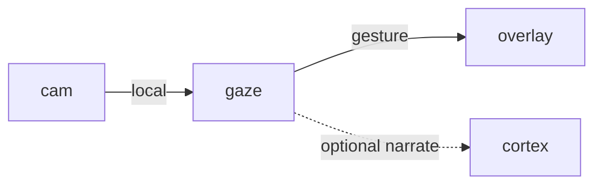

# Gaze

**Vision React App** — A planned webcam companion that translates local gestures into pet reactions.

Part of [ComputerPets](https://github.com/RicheyWorks/computerpets). Map: [computerpets-ecosystem](https://github.com/RicheyWorks/computerpets-ecosystem).

[Status](#status) · [Contract](docs/CONTRACT.md) · [Contributor start](#contributor-start) · [Ecosystem](https://github.com/RicheyWorks/computerpets-ecosystem)

| Project | At a glance |
| --- | --- |
| Status | Design scaffold; not runnable yet |
| License | MIT |
| First pet | [Flagship start guide](https://github.com/RicheyWorks/computerpets/blob/main/docs/START-HERE.md) |

## Status

This repository contains a [contract](docs/CONTRACT.md) and a [source placeholder](src/gaze/index.ts). It has no runnable application, build manifest, automated tests, or CI workflow.

The experience, interfaces, integrations, and safeguards below are **implementation plans**, not supported features. The first implementation slice defines the initial contribution target.

## Planned role

Pets already walk on the real desktop. Gaze lets them see you: wave, sit still, hold up a treat, leave the chair. The overlay stays a living sticker — this is the eyes.

For the desktop pet, start with the [flagship guide](https://github.com/RicheyWorks/computerpets/blob/main/docs/START-HERE.md).

## Intended audience

Players who opt into a webcam. Default is off.

## Out of scope

Not cloud vision. Frames stay on the box unless the player flips a named switch. Not a face-identification product.

## Proposed integration



## Planned stack

TypeScript · React 19 · Vite · MediaPipe / TensorFlow.js · WebRTC getUserMedia · optional ONNX GPU runtime

GroupId / namespace: `com.enterprisepet.gaze`  
Proposed listen surface: `5173`

## Proposed contract

### Data

`Gesture(kind, confidence, bbox) · Calibration(cameraId, restPose) · PrivacyMode(local|opt-in-cloud)`

### Surface

- WS /v1/gestures — stream {kind: wave|point|present|absent, confidence, ts}
- POST /v1/calibrate — capture a 5-second rest pose for this camera
- GET /v1/privacy — camera is local-first; frames never leave the box unless opted in

### Planned safeguards

No camera → pets ignore vision, never crash. Low light → 'absent' not 'dead'. Permission denied → one tray balloon, then quiet.

## First implementation slice

Initial implementation target:

**Local MediaPipe wave/absent detector posting WS events the overlay can sit or hop to.**

Acceptance targets: Unplug the camera: overlay still walks. Permission denied: one balloon, then silence.

## Planned environment

None required. Camera permission is the gate.

Never commit secrets. Never put Steam or chain keys in the overlay.

## Related projects

- [computerpets](https://github.com/RicheyWorks/computerpets) desktop overlay (gesture events)
- [computerpets-cortex](https://github.com/RicheyWorks/computerpets-cortex) (narrate what it saw)
- [computerpets-motion](https://github.com/RicheyWorks/computerpets-motion) (trigger animations)

## Layout

```
computerpets-gaze/
  README.md           this file
  LICENSE             MIT
  docs/CONTRACT.md    the same contract, frozen for implementers
  src/                implementation lands here
```

## Contributor start

With Git and PowerShell, clone the scaffold and read its contract and source marker:

```powershell
git clone https://github.com/RicheyWorks/computerpets-gaze.git
Set-Location computerpets-gaze
Get-Content .\docs\CONTRACT.md
Get-Content .\src\gaze\index.ts
```

Start with the [first implementation slice](#first-implementation-slice). Add the minimum project setup and tests needed for that slice, then document verified run commands. The proposed stack above is a design choice; there is no install or launch command for this checkout yet.

## Links

- Flagship: [RicheyWorks/computerpets](https://github.com/RicheyWorks/computerpets)
- This repo: [RicheyWorks/computerpets-gaze](https://github.com/RicheyWorks/computerpets-gaze)
- Map: [RicheyWorks/computerpets-ecosystem](https://github.com/RicheyWorks/computerpets-ecosystem)
- Contract file: [docs/CONTRACT.md](docs/CONTRACT.md)

## License

MIT. See [LICENSE](LICENSE).

---

*Two hundred ten living kinds. Keep them so a line does not go quiet.*
