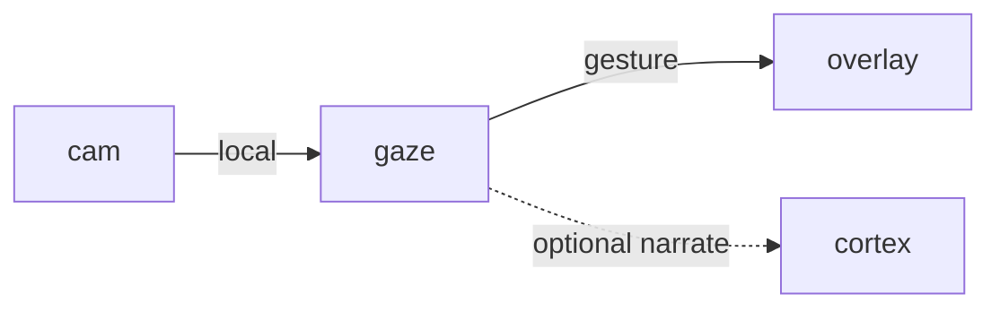

# Gaze

**Vision React App** — Webcam computer vision so desktop pets react to physical gestures in the room.

Part of [ComputerPets](https://github.com/RicheyWorks/computerpets). Map: [computerpets-ecosystem](https://github.com/RicheyWorks/computerpets-ecosystem).

| | |
| --- | --- |
| Status | Design scaffold — contract frozen, implementation next |
| License | MIT |
| First pet | Still [Rui on the desktop](https://github.com/RicheyWorks/computerpets/blob/main/docs/START-HERE.md). This organ is optional. |

## The job

Pets already walk on the real desktop. Gaze lets them see you: wave, sit still, hold up a treat, leave the chair. The overlay stays a living sticker — this is the eyes.

The flagship overlay already puts a living sticker on the real desktop (Rui first, 210 kinds). Gaze does not replace that. It is one organ.

## Who uses it

Players who opt into a webcam. Default is off.

## What it is not

Not cloud vision. Frames stay on the box unless the player flips a named switch. Not a face-identification product.

## Architecture



## Stack

TypeScript · React 19 · Vite · MediaPipe / TensorFlow.js · WebRTC getUserMedia · optional ONNX GPU runtime

GroupId / namespace: `com.enterprisepet.gaze`  
Default listen: `5173`

## Contract

### Data

`Gesture(kind, confidence, bbox) · Calibration(cameraId, restPose) · PrivacyMode(local|opt-in-cloud)`

### Surface

- WS /v1/gestures — stream {kind: wave|point|present|absent, confidence, ts}
- POST /v1/calibrate — capture a 5-second rest pose for this camera
- GET /v1/privacy — camera is local-first; frames never leave the box unless opted in

### Failure doctrine

No camera → pets ignore vision, never crash. Low light → 'absent' not 'dead'. Permission denied → one tray balloon, then quiet.

## First slice

Build this and stop. Do not boil the ocean.

**Local MediaPipe wave/absent detector posting WS events the overlay can sit or hop to.**

You know it works when: Unplug the camera: overlay still walks. Permission denied: one balloon, then silence.

## Environment

None required. Camera permission is the gate.

Never commit secrets. Never put Steam or chain keys in the overlay.

## Neighbors

- computerpets desktop overlay (gesture events)
- computerpets-cortex (narrate what it saw)
- computerpets-motion (trigger animations)

## Layout

```
computerpets-gaze/
  README.md           this file
  LICENSE             MIT
  docs/CONTRACT.md    the same contract, frozen for implementers
  src/                implementation lands here
```

## Run (Windows)

PowerShell, from this folder, after the flagship helpers (Git, Node LTS 22+, JDK 21 as needed):

```powershell
cd app; npm install; npm run dev
```

You do not need this service to meet Rui. The [flagship start-here](https://github.com/RicheyWorks/computerpets/blob/main/docs/START-HERE.md) is still the first pet.

## Links

- Flagship: [RicheyWorks/computerpets](https://github.com/RicheyWorks/computerpets)
- This repo: [RicheyWorks/computerpets-gaze](https://github.com/RicheyWorks/computerpets-gaze)
- Map: [RicheyWorks/computerpets-ecosystem](https://github.com/RicheyWorks/computerpets-ecosystem)
- Contract file: [docs/CONTRACT.md](docs/CONTRACT.md)

## License

MIT. See [LICENSE](LICENSE).

---

*Two hundred ten living kinds. Keep them so a line does not go quiet.*
